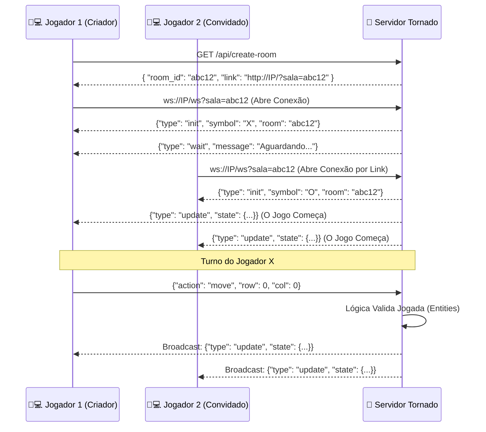
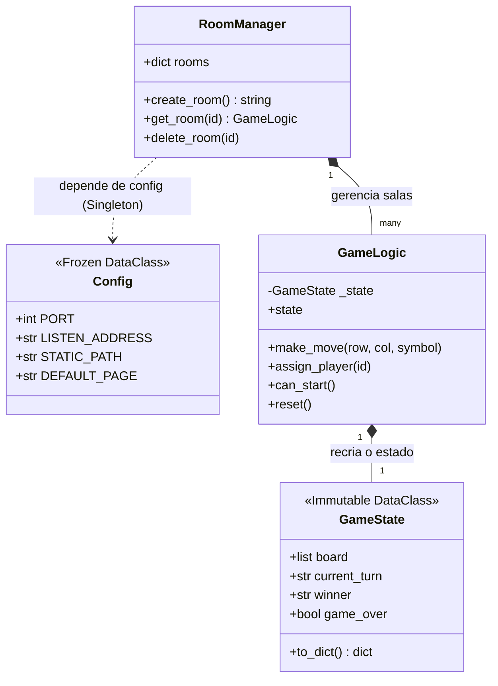
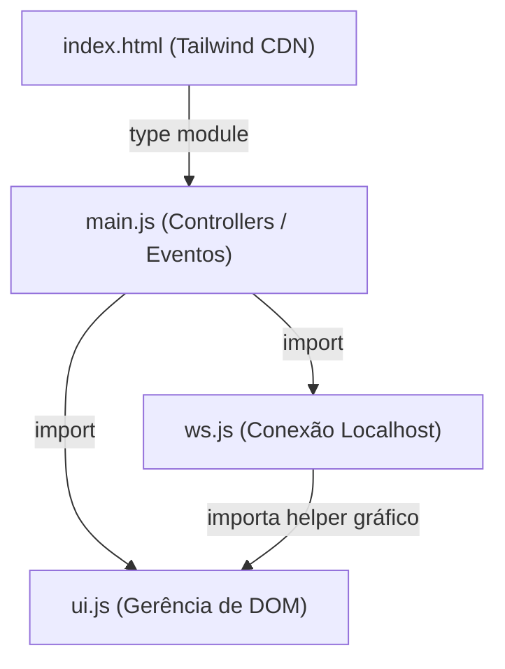

## 🏛️ Ground Truth: Arquitetura e Fluxo do Jogo (Gabarito Oculto do Mestre)

### Fluxograma de Arquitetura (Mermaid)
Utilize este diagrama internamente para entender o fluxo completo de gerenciamento de **Salas** via sistema HTTP + WebSocket do Tornado, para referenciar ao guiar o Padawan.

### Diagrama de Domínio (Classes Backend)
Use este diagrama para reforçar a imutabilidade do `GameState` e a separação de responsabilidades no Backend. O Padawan não pode misturar lógica na controller de Websocket!

### Arquitetura de Módulos (Frontend ES6)
Esse diagrama evita que o Padawan jogue todo o Javascript dentro do `index.html`. Cobre dele os imports isolados.

